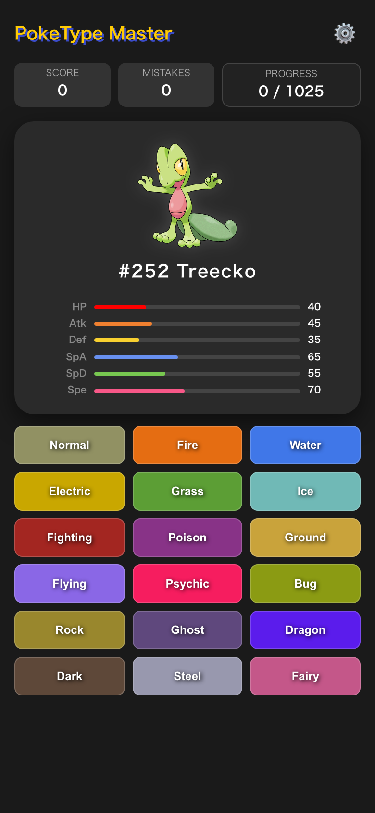
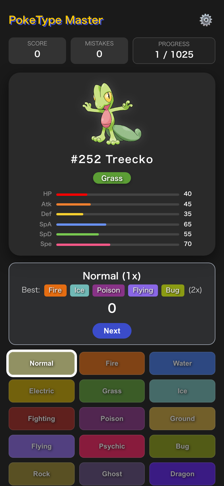
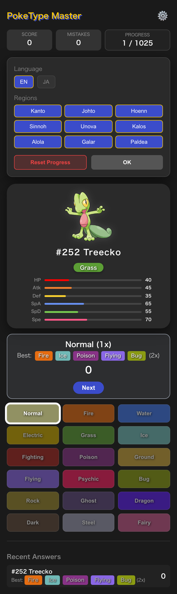

# PokeType Master

> 寶可夢屬性剋制練習遊戲 — 隨機出題，選出最有效的攻擊屬性來累積分數！

<p align="center">
  
  
  
</p>

---

## 目錄

- [功能特色](#功能特色)
- [技術棧](#技術棧)
- [專案結構](#專案結構)
- [快速開始](#快速開始)
- [資料來源與架構](#資料來源與架構)
- [遊戲邏輯](#遊戲邏輯)
- [國際化 (i18n)](#國際化-i18n)
- [狀態管理與持久化](#狀態管理與持久化)
- [開發指南](#開發指南)
- [部署](#部署)

---

## 功能特色

| 功能 | 說明 |
|------|------|
| **屬性剋制問答** | 隨機顯示一隻寶可夢（含官方插圖與六項能力值），玩家從 18 種屬性中選出最佳攻擊屬性 |
| **即時回饋** | 選擇後立即顯示倍率結果（4x / 2x / 1x / <1x / 0x）及最佳解答 |
| **計分系統** | 4x → +10 分、2x → +1 分、1x → 0 分、其餘 → −5 分 |
| **進度追蹤** | 記錄已回答的寶可夢，優先出未答過的題目；顯示 Progress（已答 / 總數） |
| **地區篩選** | 可自由勾選 9 個地區（Kanto ~ Paldea，#1 ~ #1025）組合出題範圍 |
| **雙語切換** | 支援英文 (EN) / 日文 (JA) 即時切換，包含寶可夢名稱與屬性名稱 |
| **錯題紀錄** | 自動統計答錯的寶可夢 ID，方便複習 |
| **最近回答** | 顯示最近 5 題的歷史紀錄，含最佳屬性提示 |
| **4x 弱點警告** | 遇到擁有 4 倍弱點的寶可夢時會特別標示 |
| **深色主題** | 全站深色 UI，適合長時間練習 |

---

## 技術棧

| 類別 | 技術 |
|------|------|
| 框架 | [Vue 3](https://vuejs.org/) (`<script setup>` + Composition API) |
| 語言 | [TypeScript](https://www.typescriptlang.org/) ~6.0 |
| 建構工具 | [Vite](https://vite.dev/) 8.x |
| 型別檢查 | [vue-tsc](https://github.com/vuejs/language-tools) 3.x |
| API | [PokéAPI v2](https://pokeapi.co/) (RESTful，免費免 Key) |
| 持久化 | `localStorage` |
| 部署 | 純靜態，可部署到 GitHub Pages / Netlify / Vercel 等 |

---

## 專案結構

```
├── index.html                 # 入口 HTML
├── package.json               # 依賴與 npm scripts
├── vite.config.ts             # Vite 設定
├── tsconfig.json              # TypeScript 專案參考根設定
├── tsconfig.app.json          # App 端 TS 設定
├── tsconfig.node.json         # Node 端 TS 設定（Vite config 用）
├── public/
│   ├── favicon.svg
│   └── icons.svg
└── src/
    ├── main.ts                # Vue 應用進入點
    ├── App.vue                # 唯一的 SFC（單檔元件），包含所有遊戲邏輯與 UI
    ├── style.css              # 全域樣式（dark theme 基礎設定）
    ├── assets/                # 靜態資源（目前為空）
    ├── components/            # 元件目錄（目前為空，可拆分 App.vue）
    └── data/
        ├── typeChart.ts       # 18 種屬性的剋制表、顏色對照表、類型定義
        └── translations.ts    # EN/JA 翻譯文本、9 個地區定義與 ID 範圍
```

---

## 快速開始

### 環境需求

- **Node.js** ≥ 18
- **npm** ≥ 9（或等效的 pnpm / yarn）

### 安裝與啟動

```bash
# 1. 複製專案
git clone <repo-url>
cd poke-fighting-best-type

# 2. 安裝依賴
npm install

# 3. 開發模式（Hot Reload）
npm run dev
# → http://localhost:5173

# 4. 型別檢查 + 生產建構
npm run build

# 5. 預覽生產建構結果
npm run preview
```

### npm scripts

| 指令 | 說明 |
|------|------|
| `npm run dev` | 啟動 Vite dev server（HMR） |
| `npm run build` | 先執行 `vue-tsc -b` 型別檢查，再用 Vite 打包到 `dist/` |
| `npm run preview` | 本地預覽 `dist/` 的建構產出 |

---

## 資料來源與架構

### PokéAPI 呼叫

每次出題時會**並行請求**兩個端點：

```
GET https://pokeapi.co/api/v2/pokemon/{id}          → 屬性、能力值、圖片
GET https://pokeapi.co/api/v2/pokemon-species/{id}   → 多語系名稱
```

- 圖片優先使用 Official Artwork（`sprites.other['official-artwork'].front_default`）
- 日文名稱優先取 `ja-Hrkt`，其次 `ja`

### 屬性剋制表 (`typeChart.ts`)

- `TYPE_CHART` 為 `Record<PokemonType, Partial<Record<PokemonType, number>>>` 結構
- Key = 攻擊屬性，Value = 各防禦屬性的倍率（2 / 0.5 / 0）
- **未列出的組合預設為 1x**（一般效果）
- `TYPE_COLORS` 提供每種屬性的代表色
- `ALL_TYPES` 為 18 種屬性的有序陣列

---

## 遊戲邏輯

### 倍率計算

```typescript
// 攻擊屬性 vs 防禦方所有屬性的乘積
const calculateMultiplier = (attackType, defenderTypes) => {
  let multiplier = 1;
  defenderTypes.forEach(defType => {
    const effect = TYPE_CHART[attackType][defType];
    if (effect !== undefined) multiplier *= effect;
  });
  return multiplier;
};
```

雙屬性寶可夢的倍率為兩個單屬性倍率的**乘積**，因此可能產生 4x、0.25x、0x 等結果。

### 計分規則

| 倍率 | 得分 |
|------|------|
| 4x | +10 |
| 2x | +1 |
| 1x | 0 |
| <1x 或 0x | −5 |

### 出題策略

1. 根據使用者勾選的**地區**產生可用 ID 池 (`currentPool`)
2. 從池中**排除已回答過的 ID**，優先出未答題目
3. 全部答完後會重新從完整池中隨機出題

---

## 國際化 (i18n)

翻譯定義在 `src/data/translations.ts` 的 `TRANSLATIONS` 物件中：

```typescript
TRANSLATIONS.en  // 英文
TRANSLATIONS.ja  // 日文
```

每個語系包含：
- UI 文字（標題、按鈕、提示訊息）
- 屬性名稱（`typeNames` 子物件，18 種屬性的翻譯）
- 能力值標籤（HP / Atk / Def / SpA / SpD / Spe）

### 新增語系步驟

1. 在 `translations.ts` 的 `TRANSLATIONS` 中新增語系 key（如 `zh`）
2. 補齊所有翻譯欄位（可參考 `en` 結構）
3. 在 `REGIONS` 中為每個地區新增對應語系名稱
4. 更新 `GameState['language']` 的 union type
5. 在 `App.vue` 設定面板中新增語系按鈕

---

## 狀態管理與持久化

### GameState 介面

```typescript
interface GameState {
  score: number;                    // 累積分數
  history: Array<{                  // 所有回答紀錄
    id: number;
    names: { en: string; ja: string };
    types: PokemonType[];
    selected: PokemonType;          // 玩家選擇的屬性
    multiplier: number;             // 實際倍率
    points: number;                 // 該題得分
    bestTypes: PokemonType[];       // 最佳攻擊屬性
    maxMultiplier: number;          // 最大可能倍率
  }>;
  wrongIds: number[];               // 答錯的寶可夢 ID
  language: 'en' | 'ja';           // 當前語系
  selectedRegions: string[];        // 已勾選的地區 ID
}
```

### 持久化

- 存儲 key：`poke_type_master_v3`
- 讀取時機：`onMounted`（頁面載入）
- 寫入時機：每次答題、切換語言、切換地區、重置進度

---

## 開發指南

### 拆分元件建議

目前所有邏輯集中在 `App.vue`（約 500 行），建議未來可拆分為：

| 元件名稱 | 負責內容 |
|----------|---------|
| `PokemonCard.vue` | 寶可夢圖片、名稱、屬性徽章、能力值長條圖 |
| `TypeGrid.vue` | 18 種屬性按鈕的選擇面板 |
| `ResultFeedback.vue` | 答題後的回饋面板（倍率、得分、最佳解答提示） |
| `SettingsPanel.vue` | 語系切換、地區篩選、重置按鈕 |
| `ScoreBoard.vue` | 頂部分數 / 錯誤數 / 進度顯示 |
| `HistoryList.vue` | 底部的最近回答列表 |

### 新增地區

在 `src/data/translations.ts` 的 `REGIONS` 陣列中新增項目：

```typescript
{ id: 'new-region', name: { en: 'NewRegion', ja: '新地方' }, range: [1026, 1100] }
```

### 自訂計分

修改 `App.vue` 中 `handleTypeSelect()` 函式內的分數判斷邏輯。

### 程式碼風格

- 使用 Vue 3 `<script setup>` 語法
- TypeScript strict mode
- 元件內使用 `ref` / `computed` / `watch` 進行狀態管理
- 樣式使用 `<style scoped>`，避免全域污染

---

## 部署

```bash
npm run build
```

產出位於 `dist/` 資料夾，為純靜態檔案，可直接部署：

- **GitHub Pages**：將 `dist/` 推送到 `gh-pages` 分支
- **Netlify / Vercel**：設定 Build Command 為 `npm run build`、Output 為 `dist`
- **任意靜態伺服器**：直接將 `dist/` 內容放到 web root

> 注意：如果部署到子路徑（如 `https://user.github.io/repo/`），需要在 `vite.config.ts` 中設定 `base: '/repo/'`。

---

## License

This project is for educational and personal use. Pokémon data is provided by [PokéAPI](https://pokeapi.co/).
